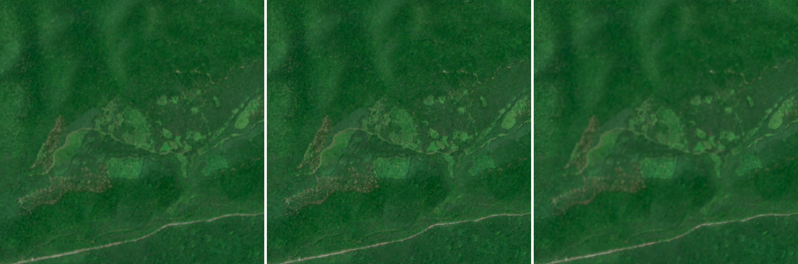
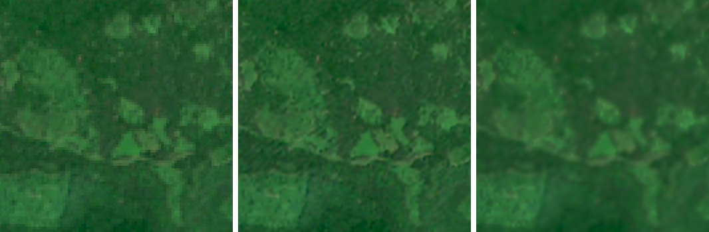
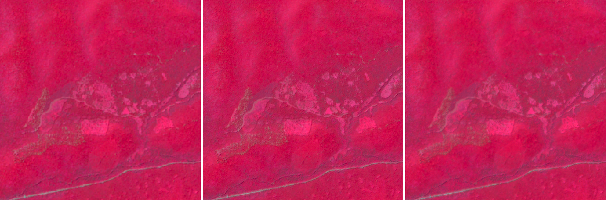

# NTRO-SRM: Deep Learning Based Super-Resolution Mapping Framework

[](https://www.python.org/)
[](https://pytorch.org/)
[](https://fastapi.tiangolo.com/)
[](LICENSE)
[](tests/)

> **Problem Statement 26142:** Deep Learning Based Super Resolution Mapping (SRM) from Medium Resolution Satellite Imageries (Sentinel-2 10m to ~2.5m Ground Sampling Distance).

**NTRO-SRM** is a modular, production-grade geospatial super-resolution platform designed to upscale Sentinel-2 Level-2A multi-spectral imagery from $10\text{m}$ to $2.5\text{m}$ Ground Sampling Distance ($4\times$ spatial factor). The platform provides both an interactive Leaflet-based Web GIS application and an automated command-line batch pipeline, featuring a dual-model neural engine, on-the-fly STAC satellite search, and full preservation of geospatial metadata.

---

## Key Features

- **10-Band Multi-Spectral Super-Resolution:** Simultaneous $4\times$ upscaling across all 10 Sentinel-2 surface reflectance bands:
  - **Visible (10m):** `B02` (Blue), `B03` (Green), `B04` (Red)
  - **Red Edge (20m $\to$ 10m):** `B05`, `B06`, `B07`
  - **Near-Infrared (10m / 20m):** `B08` (Broad NIR), `B8A` (Narrow NIR)
  - **Short-Wave Infrared (20m $\to$ 10m):** `B11` (SWIR-1), `B12` (SWIR-2)
- **Dual-Model Neural Engine:**
  - ⚡ **SEN2SR-Lite (Default Baseline):** Fast CNN architecture based on Swift Parameter-free Attention (~0.47M parameters, ~2s runtime).
  - ✨ **SEN2SR-Swin2SR (Higher-Capacity Model):** Vision Transformer (Swin2SR) + State-Space recurrence (MambaSR) (~12.9M parameters, enhanced structural definition).
- **Memory-Safe Chunked Recurrence:** Custom PyTorch chunked selective scan (`mamba_scan.py`) capping intermediate allocations below 600 MB, enabling full Vision Transformer execution on standard 6GB laptop GPUs without custom C++ builds.
- **Geospatial & Radiometric Integrity:**
  - Preserves exact Coordinate Reference System (CRS) and affine geotransforms.
  - Outputs 32-bit floating-point multi-band GeoTIFFs compliant with GDAL, QGIS, and ArcGIS.
  - Calibrated physical reflectance scaling for photorealistic Natural RGB and Infrared (CIR) visualization.
- **Interactive Web GIS Interface:**
  - Google Maps & Satellite base layers.
  - Interactive AOI bounding box drawing and 1-click location presets (Mountain Lake, Salinas Valley, Frankfurt, Rotterdam, Dubai, Lake Tahoe).
  - Dual-layer swipe comparison slider (10m Native vs. 2.5m Bicubic vs. 2.5m Neural SR) and opacity blending.
  - Direct drag-and-drop GeoTIFF upload supporting custom satellite patches.
- **Live Satellite Ingestion:** Dual STAC connectivity with Copernicus Data Space Ecosystem (CDSE) and AWS Earth Search.

---

## System Architecture

```mermaid
flowchart TD
    subgraph DataIngestion ["1. Ingestion & STAC Catalog"]
        AOI["User AOI / Bounding Box"] --> Search["STAC Query (Copernicus CDSE / AWS Earth Search)"]
        Search --> Stream["Windowed COG Band Streaming (10 Bands)"]
        Upload["Direct GeoTIFF Upload"] --> Validate["Metadata & CRS Validation"]
    end

    subgraph Preprocessing ["2. Radiometric Preprocessing"]
        Stream --> Norm["Reflectance Normalization [0, 1]"]
        Validate --> Norm
        Norm --> Tile["Sliding Window Tiling (128x128, Overlap=32)"]
    end

    subgraph NeuralEngine ["3. Super-Resolution Engine"]
        Tile --> ModelSwitch{"Model Selector"}
        ModelSwitch -->|Lite (0.47M params)| SEN2SRLite["SEN2SR-Lite (SPAN CNN)"]
        ModelSwitch -->|Swin (12.9M params)| SEN2SRSwin["SEN2SR-Swin2SR (ViT + MambaSR)"]
        SEN2SRSwin --> ChunkScan["ultra_chunked_selective_scan (PyTorch)"]
    end

    subgraph ExportVisual ["4. Product Delivery & GIS UI"]
        SEN2SRLite --> Blend["Overlap Blending & Recombination"]
        ChunkScan --> Blend
        Blend --> GeoTIFF["10-Band 2.5m GeoTIFF Export (EPSG Preserved)"]
        Blend --> Previews["Natural RGB & False-Color CIR Overlays"]
        Previews --> Leaflet["Interactive Web GIS (Swipe Slider / Blend)"]
        GeoTIFF --> Download["Direct Product Download"]
    end
```

---

## 1-Minute Quickstart

Clone the repository and run the automated setup script. It automatically detects your GPU, creates a dedicated virtual environment, installs all dependencies, downloads neural weights, and verifies tests:

```bash
# 1. Clone the repository
git clone https://github.com/your-username/NTRO-SRM.git
cd NTRO-SRM

# 2. Run automated setup
./setup.sh

# 3. Activate the environment
source venv/bin/activate

# 4. Launch the Web GIS Interface
python scripts/run_web.py --port 8000
```
Open **`http://127.0.0.1:8000`** in your browser.

---

## Model Benchmark & Hardware Profiling

Evaluated on the Mountain Lake Sentinel-2 L2A scene (`datasets/sample_s2/sample_s2_l2a.tif`, $256 \times 256$ pixels at 10m GSD $\to$ $1024 \times 1024$ pixels at 2.5m GSD) on an **NVIDIA GeForce RTX 3050 6GB Laptop GPU**:

| Metric | SEN2SR-Lite (Default) | SEN2SR-Swin2SR (Higher-Capacity) |
| :--- | :--- | :--- |
| **Architecture** | Swift Parameter-free Attention CNN | Swin2SR Vision Transformer + MambaSR |
| **Parameter Count** | **~0.47 Million** | **~12.9 Million** ($27.4\times$ capacity) |
| **Input $\to$ Output Grid** | $256\times 256 \to 1024\times 1024$ (16 tiles) | $256\times 256 \to 1024\times 1024$ (16 tiles) |
| **Spectral Channels** | 10 Bands (`B02`..`B12`) | 10 Bands (`B02`..`B12`) |
| **Peak GPU VRAM** | **310.4 MB** | **2,461.0 MB** (~2.46 GB) |
| **Inference Runtime** | **2.25 seconds** | **720.80 seconds** (~12.0 min, pure PyTorch scan) |
| **Target Application** | Fast screening, interactive web panning | Complex infrastructure, dense edge reconstruction |

---

## Visual Comparison

Comparison generated from the Mountain Lake Sentinel-2 test scene:

### 1. True Color RGB (Full $2.56\text{km} \times 2.56\text{km}$ Scene)

*Left: Native Sentinel-2 10m. Middle: SEN2SR-Lite 2.5m. Right: SEN2SR-Swin2SR 2.5m.*

### 2. High-Resolution Structural Detail (Center Crop)

*Notice the enhanced boundary definition between forest canopy and shoreline in the 2.5m reconstructions.*

### 3. False Color Infrared (CIR - Vegetation Vigor)

*Combines NIR (B08), Red (B04), and Green (B03) in calibrated physical surface reflectance.*

---

## Usage Guide

For complete, detailed instructions, see:
- 📖 **[INSTALL.md](INSTALL.md):** Complete installation guide for Linux, Windows (WSL2), macOS, and CUDA configuration.
- 📖 **[USAGE.md](USAGE.md):** Comprehensive guide covering the Web UI, CLI flags, and Python SDK.

### Command-Line Interface (CLI)

Run super-resolution directly on any multi-band GeoTIFF:

```bash
source venv/bin/activate

# Fast Baseline (SEN2SR-Lite)
python scripts/sr_sentinel2.py \
  --input datasets/sample_s2/sample_s2_l2a.tif \
  --output outputs/sr_lite_2.5m.tif \
  --model lite \
  --device cuda

# High-Quality Vision Transformer (SEN2SR-Swin2SR)
python scripts/sr_sentinel2.py \
  --input datasets/sample_s2/sample_s2_l2a.tif \
  --output outputs/sr_swin_2.5m.tif \
  --model swin2sr \
  --device cuda
```

### Python SDK

```python
from pathlib import Path
from ntro_srm.inference.sentinel2_pipeline import Sentinel2SRPipeline

pipeline = Sentinel2SRPipeline(model_variant="lite", device="cuda")

result = pipeline.predict(
    input_path=Path("datasets/sample_s2/sample_s2_l2a.tif"),
    output_path=Path("outputs/result_2.5m.tif"),
    overlap=32,
)

print(f"Output Resolution: {result.output_shape} (10 bands, 2.5m GSD)")
print(f"Coordinate Reference System: {result.crs}")
```

---

## Project Structure

```text
NTRO-SRM/
├── checkpoints/              # Downloaded model weights (SEN2SRLite, SEN2SR)
├── configs/                  # Pipeline and data configurations
├── datasets/
│   ├── cache/                # Cached streaming tiles from STAC
│   └── sample_s2/            # Pre-downloaded sample Sentinel-2 scene (455 KB)
├── outputs/
│   ├── comparisons/          # Benchmark visual comparisons and triptychs
│   └── web_jobs/             # Asynchronous web job outputs & GeoTIFFs
├── scripts/
│   ├── compare_models.py     # Evaluation & triptych generator
│   ├── download_checkpoints.py # Pretrained weights downloader
│   ├── run_web.py            # Web application launcher
│   └── sr_sentinel2.py       # Command-line interface (CLI)
├── src/ntro_srm/
│   ├── data/                 # Sentinel-2 raster ingestion and band extraction
│   ├── evaluation/           # Geospatial metrics (PSNR, SSIM, SAM, ERGAS)
│   ├── inference/            # Sentinel2SRPipeline & GeoTIFF writer
│   ├── models/               # SEN2SRModel adapter & mamba_scan.py
│   ├── preprocessing/        # Radiometric normalization & transforms
│   ├── utils/                # Affine transform & GeoTIFF utilities
│   └── web/                  # FastAPI router, schemas, & STAC services
├── tests/                    # Complete pytest suite (26 passing tests)
├── third_party/              # Upstream ESAOpenSR SEN2SR repository (100% untouched)
├── web/
│   ├── static/               # CSS, JavaScript, icons, Leaflet assets
│   └── templates/            # index.html GIS interface
├── .env.example              # Template Copernicus CDSE credentials
├── .gitignore                # Git ignore configuration
├── .gitmodules               # Submodule specification for ESAOpenSR/SEN2SR
├── INSTALL.md                # Comprehensive installation manual
├── LICENSE                   # MIT License
├── MANIFEST.in               # Packaging manifest
├── pyproject.toml            # PEP 517/518 build definition
├── README.md                 # Project documentation
├── requirements.txt          # Pinned runtime dependencies
├── setup.py                  # Standard Python package setup
└── setup.sh                  # 1-click automated setup script
```

---

## Testing & Quality Assurance

Run the automated test suite covering schemas, data ingestion, radiometric transforms, model adapters, and REST API endpoints:

```bash
source venv/bin/activate
pytest -q
```
```text
..........................                                               [100%]
26 passed in 42.64s
```

---

## Scientific Reconstruction Notice

> **Notice:** 2.5m imagery generated by this framework is a neural super-resolution reconstruction. High-frequency spatial detail is model-inferred and is not directly observed by the Sentinel-2 sensor. Physical spectral fidelity is calibrated to Sentinel-2 Level-2A surface reflectance.
> In accordance with operational remote sensing standards, **SEN2SR-Swin2SR** is designated strictly as a **Higher-capacity model**, not as "ground truth" or "more accurate".

---

## License & Acknowledgments

This project is licensed under the **MIT License** — see the [LICENSE](LICENSE) file for details.

### Acknowledgments
- **ESAOpenSR:** Developed by the European Space Agency Open Science Earth Observation Super-Resolution team.
- **TACo Foundation:** Pretrained SEN2SR model weights hosted on Hugging Face.
- **Copernicus Sentinel-2:** Multi-spectral European Space Agency Earth Observation mission data.
